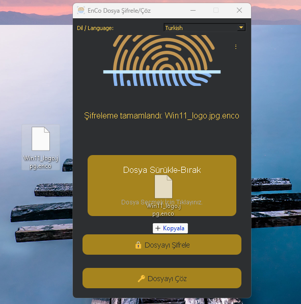

<a href="#">
    
</a>

# EnCo
EnCo is a Cross-Platform file Encryption application developed in Python. This application allows users to Encrypt and Decrypt their files. Encrypt and Decrypt operations are performed with the AES crypto algorithm.

<h1 align="center">EnCo Logo</h1>

<p align="center">
  
</p>

----------------------

# Linux Screenshot
  

# Windows Screenshot
 

--------------------
Install Git Clone and Python3

Github Package Must Be Installed On Your Device.

git
```bash
sudo apt install git -y
```

Python3
```bash
sudo apt install python3 -y 

```

pip
```bash
sudo apt install python3-pip

```

# Required Libraries

PyQt5
```bash
pip install PyQt5
```
cryptography
```bash
pip install cryptography
```

----------------------------------


# Installation
Install EnCo

```bash
sudo git clone https://github.com/cektor/EnCo.git
```
```bash
cd EnCo
```

```bash
python enco.py
```
or

```bash
python3 enco.py

```

# To compile

NOTE: For Compilation Process pyinstaller must be installed. To Install If Not Installed.

pip install pyinstaller 

Linux Terminal 
```bash
pytohn3 -m pyinstaller --onefile --windowed enco.py
```

Windows VSCode Terminal 
```bash
pyinstaller --onefile --noconsole enco.py
```

MacOS VSCode Terminal 
```bash
pyinstaller --onefile --noconsole enco.py
```

# To install directly on Windows or Linux


Linux (based debian) Terminal: Linux (debian based distributions) To install directly from Terminal.
```bash
 wget -O EnCo_Linux64.deb https://github.com/cektor/EnCo/releases/download/1.00/Setup_Linux64.deb && sudo apt install ./EnCo_Linux64.deb && sudo apt-get install -f
```

Windows Installer CMD (PowerShell): To Install from Windows CMD with Direct Connection.
```bash
powershell -Command "Invoke-WebRequest -Uri 'https://github.com/cektor/EnCo/releases/download/1.00/Setup_Win64.exe' -OutFile 'Setup_Win64.exe'" && start /wait Setup_Win64.exe
```

Release Page: https://github.com/cektor/EnCo/releases/tag/1.00

----------------------------------
